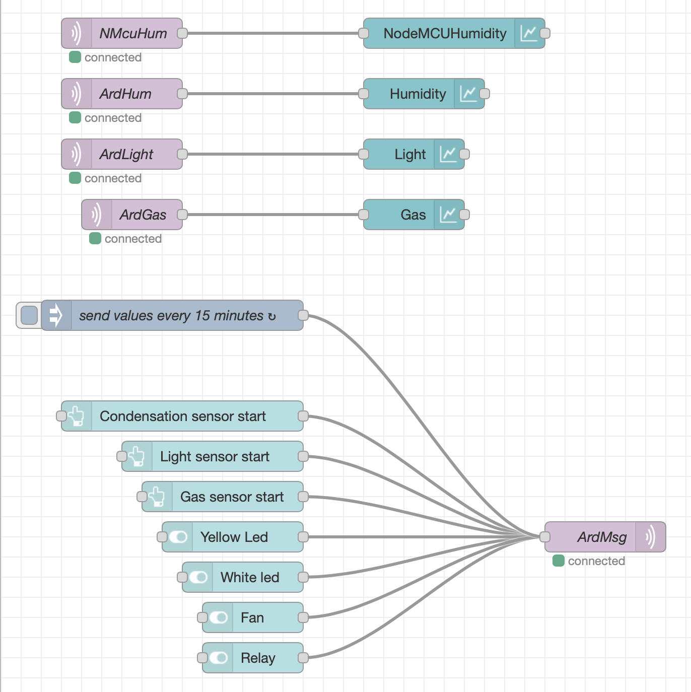

# Monitor a process with Cumulocity and open source technology

This is a tutorial with instructions to build a process monitoring system using Cumulocity, Node-Red and other technologies

To monitor and control processes (in factories), there are many solutions available in the market. They work fine in most cases, but there are some disadvantages with these smart devices/sensors. Some of these devices are not compatible or not open for integrations with other devices, so you need different systems or different dashboards to operate them and interpret the data coming from the sensors.

Wouldn’t it be nice if you could build something yourself, combining the output of the devices and see this output and control the devices from one dashboard? And how about an easy-to-use platform to help you monitor the processes?
[This blog, with more background]()and this tutorial on Github describe how to do that, using Cumulocity and open-source technologies and using relatively inexpensive devices and sensors.

When you have completed this tutorial, you will understand how to:

* Connect devices to Cumulocity
* Connect sensors and actuators to an Arduino and read their values.
* Set up a gateway on a Raspberry Pi.
* Run a MQTT Server on a Raspberry Pi.
* Connect sensors to a NodeMCU device and read their values (Optional).
* Build applications in Node-RED.
* Use Bluetooth, WIFI and MQTT  to communicate between the devices.
* Send messages to Slack.

## Architecture Diagram


 
The gateway is the heart of the system. This device receives all data from the other devices and sends this to Cumulocity, where it is displayed on a dashboard in real-time. The gateway also receives commands from Cumulocity to send it to the devices. The connection between the Gateway and Cumulocity is using the MQTT protocol.
There are 2 devices with sensors:

NodeMCU, this device has only one sensor (humidity) and is connected to the gateway via MQTT as well. I have set up a local MQTT server to connect some of the local devices.
Client 1 has 3 sensors (light, humidity and gas) that send their data via serial to the gateway.
This device has also 2 actuators (relay and fan) which can be controlled by sending commands to this device, for instance from Cumulocity.
The mobile device is connected with Bluetooth to Client1 to interact with the process if there is an incident and there is no wifi and internet connection anymore.
Also, the local machine is connected to the system via MQTT. This local machine is running an extra dashboard to monitor and control the process when there is no internet connection.

All warnings and alarms are also being sent to Slack via a webhook, to inform people involved, like process operators.

## Included Components

* [Cumulocity](https://www.softwareag.cloud/site/product/cumulocity-iot.html#/), Cumulocity IoT was built from the ground up to be open, rapid to deploy and distributed.
* [Node-RED](https://nodered.org), open-source programming tool, where you easily can combine hardware devices, API's etc. to build applications.
* [MQTT](https://mqtt.org), open-source protocol for sending messages.
* Bluetooth.
* [Arduino](www.arduino.cc), open-source microprocessor.
* [Raspberry Pi](http://raspberrypi.org), credit-card-sized minicomputer.
* Sensors: Gas sensor, moisture sensor, light sensor, 
* Actuators: fan, relay, 
* Node-MCU, microprocessor.
* [Slack](http://Slack.com).

## Featured technologies

* Node.js
* C++ for Arduino and Node-MCU
* Node-RED

## Prerequisites

* [Node.js installation (with NPM)](https://nodejs.org/en/download/)
* [Arduino IDE](https://www.arduino.cc/en/software) (or use the web-editor) + libraries
* Familiarity with basic Arduino concepts
* Familiarity with basic Node-RED concepts

## Steps

Follow these steps to set up and run this tutorial. The steps are described in detail below.

1. Do some shopping
2. Clone this repo
3. Set-up Cumulocity
4. Set-up Client 1
5. Set-up Node-MCU
6. Setup Node-RED on both Raspberry Pi's and local machine
7. Set up local MQTT Server
8. Set up Gateway
9. Build a dashboard

## Step 1 Do some shopping 

In this tutorial the following components are used:

* Arduino (clone) with a sensor shield, Bluetooth board, light sensor, humidity sensor, gas sensor, relay and fan. 
* Raspberry PI 1: This device is connected to a gateway, I used a Raspberry Pi 4 for this, but this can also be a Raspberry Pi 3. This Raspberry acts as a gateway between the Cumulocity and the devices. This gateway is also connected to the local machine. OPTIONAL: you can also host the gateway on another device, like your local machine.
* Raspberry Pi 2: This Raspberry Pi acts as an MQTT server. I use a Raspberry Pi 3 for that with a Sense HAT board. A Sense Hat is an additional board on top of a Raspberry Pi. It consists of a LED matrix. This Sensehat is optional, I use it for displaying traffic going through the MQTT server on the LED Matrix. OPTIONAL: Instead of setting up an MQTT Broker yourself, you can also use a public broker for this or run a broker on another device.
NodeMCU: there are different devices based on ESP8266, It is open source and relatively cheap and easy to work with. I am using a LoLin board, which has WIFI on board, I have connected a sensor to it to monitor air humidity.

For this tutorial, I used different pieces of hardware. To use all the possibilities I am going to mention in this tutorial, I advise you to have all parts available. You can also build the functionalities in this tutorial with only having an Arduino with one sensor. All the parts running on the 2 Raspberry Pi's can also run on your laptop.


## Step 2 Clone this repo

First let's get the code. From the terminal of the system, you plan on running Node-RED from, do the following:

- Clone this repo:

```
$ git clone https://github.com/Hansb001/Monitor-a-process-with-Cumulocity-and-open-source

```

Move into the directory of the cloned repo:
```
$ cd Monitor-a-process-with-Cumulocity-and-open-source
```
Note: For Raspberry Pi users, details on accessing the command line can be found in the remote access documentation if not connecting with a screen and keyboard.

## Step 3 Set up Cumulocity

In this step you set up Cumulocity so it receives data and shows it on the dashboard.
It's recommended to start from here: [Getting started with Cumulocity](https://cumulocity.com/guides/users-guide/getting-started/)
To create a free account go to:[Software AG Cloud](https://cumulocity.com/guides/users-guide/getting-started/)

Next step is to add devices, taht can be done in different ways. You can add devices via device management, but als from the device itself, which I think is much easier. In Step 8 regeristring the gateway, from the device itself is explained.
You can add extra functionlality to Cumulocity, like the possibility to send commands to the device. That can also be set-up from the device itself. That is alos explained in step 8.

## Step 4 Set-up Client 1

In this step you upload some code to the Arduino which is used as Client 1. This code can be found [here]. This code exsists of functions to read and control the sensors and actuaros connected to this device. Each function is triggered by a letter. So by sending a letter to this device an action will be taken, like starting a fan. Sending another letter wil stop the fan.

Another function which is part of this application is to connect a mobile device via the Bluetooth Module.

On the dashboard in Cumulocity the data from the following sensors is being displayed:
* gas sensor.
* humidity sensor.
* light sensor.

Here you see an expample for the gas sensor:

Gas sensor (line 185): it sends the the value of gas to the console and serial port when ``` i ``` is receiceved by the dashboard or the mobile device.
```
184 case 'i'://if val is character 'i'，program will circulate
185      Serial.println((String)"Gas= "+gas);
186      //Serial.println(gas);//output the value of variable gas in new lines
187      delay(100);
188      break;//exit loop
```

The other sensors and actuators work in a similar way.

## Step 5 Set-up  Node-MCU and humidity sensor.

An extra device is added to monitor the air humidity as well. I used a NodeMCU device for that. I used a different device for 2 reasons: it is a relatively cheap device and to show how easy it is to connect different devices. This device is based on ESP8266 which is commonly used in cases like this.

This device its data from the humidity sensor via MQTT to the gateway to display it on the dashboard in Cumulocity.  To upload and compile the code, I use the Arduino IDE.

The code is available [here](/code/NodeMCU).

## Step 6 Set up Node-RED

Node-RED is a programming tool for wiring together hardware devices, APIs and online services.

It is a browser-based editor to connect all kinds of nodes together with wires. Every node has its own functionality. you get a lot of standard nodes, but it is also possible to install extra nodes needed for your application. All the nodes together in your working area are called a flow and can be deployed to its runtime in a single click.

I am using Node-RED on different devices to collect the data from the process to show it on the dashboard. Therefore I installed Node-RED on both Raspberry Pi's and on my local machine. If you are using an earlier version of Raspian (Rasberry Pi operating system) Node-RED might be installed already. I will now explain what you need to do before you can start with importing or building the flows in the next steps.

In short, you need to do the following steps for both Raspberry Pi's and the local machine:
1. Install Node.js and nvm.
2. Install Node-RED.
3. Add security to Node-RED.
4. Install extra nodes.

As installation for both devices is a bit different, I will first explain how to install on Raspberry Pi.

#### Install Node-RED on Raspberry PI

The following information comes from the Node-RED documentation and can also be found [here](https://nodered.org/docs/getting-started/raspberrypi)

Running the following command will download and run a script. This script is to install Node.js, npm and Node-RED onto a Raspberry Pi. (The script can also be used to upgrade an existing install when a new release is available).
```
bash <(curl -sL https://raw.githubusercontent.com/node-red/linux-installers/master/deb/update-nodejs-and-nodered)
```

#### Install Node-RED on Local Machine (Mac)

First, you need to install node.js and and npm. Download the latest package [here](https://nodejs.org/en/) this includes Node.js and npm. 

Then you can install Node-RED with the following command (found in the Node-RED [documentation](https://nodered.org/docs/getting-started/local#installing-with-npm)):

```sudo npm install -g --unsafe-perm node-red```

For other operating systems, have a look in the Node-RED [documentation](https://nodered.org/docs/getting-started/local#installing-with-npm)


#### Install additional Node-RED nodes on Raspberry Pi and Local Machine 

You can install additional nodes to have additional functionalities available.

You can do that as follows:

1. Click on the 'hamburger menu' (in the top right of the screen, on the right of the deploy button).
2. Manage palette.
3. Install tab.
4. Depending on what device you are working on, search for one of the following:

On the Raspberry Pi for the gateway you need to install:

```
node-red-contrib-image-output
node-red-contrib-slack-files
node-red-node-serialport
node-red-node-base64

```

On the Raspberry Pi for the MQTT server you need to install:

```
node-red-node-pi-sense-hat
```

On the local machine you need to install:
```
node-red-dashboard
```

When installation is complete, you will see the nodes apear in the list of nodes on the left.

## Step 7 Set up local MQTT Server

MQTT is a lightweight and simple messaging protocol, therefore, you need a broker that receives and sends messages based on a certain topic. If you want to read more about MQTT, please go [here](https://mqtt.org).

In this step, I used a Raspberry Pi for an MQTT Broker. You can also host it locally on your laptop or use a test-broker as found on the web. I used Mosquito as this is the most used on Raspberry, but basically, you can use any broker.

To install, use the following command: ```sudo apt install mosquitto mosquitto-clients```.

Start the broker and automatically start after reboot using the following command:
```
sudo systemctl enable mosquitto
```
The broker should now be running. You can check this via the systemd service status:
```
sudo systemctl status mosquitto
```
The output should be similar as the following:
```
pi@rpiMqttServer:~ $ sudo systemctl status mosquitto
● mosquitto.service - LSB: mosquitto MQTT v3.1 message broker
   Loaded: loaded (/etc/init.d/mosquitto; generated; vendor preset: enabled)
   Active: active (running) since Thu 2020-11-12 13:17:10 CET; 4 days ago
     Docs: man:systemd-sysv-generator(8)
  Process: 331 ExecStart=/etc/init.d/mosquitto start (code=exited, status=0/SUCCESS)
    Tasks: 1 (limit: 4915)
   CGroup: /system.slice/mosquitto.service
           └─444 /usr/sbin/mosquitto -c /etc/mosquitto/mosquitto.conf

Nov 12 13:17:07 rpiMqttServer systemd[1]: Starting LSB: mosquitto MQTT v3.1 message broker...
Nov 12 13:17:10 rpiMqttServer mosquitto[331]: Starting network daemon:: mosquitto.
Nov 12 13:17:10 rpiMqttServer systemd[1]: Started LSB: mosquitto MQTT v3.1 message broker.
```
Now it is time to test the broker. Therefore you need to subscribe to an MQTT topic.

A topic is simply a string that looks like a file system path. It has the general form:
```
a/b/c/...
```
The great thing about MQTT is that you can just make up topics which describe your needs. You don’t need to register them anywhere. In this test we use ```test/message```
In the existing terminal, subscribe to the test/message topic:

```mosquitto_sub -h localhost -t "test/message"```

This will send a message to the MQTT broker which is currently running on the same system (-h localhost option). But it could be running somewhere else.


Because your current terminal is listening to the topic, you will need to open another terminal. 

Once open, publish message to the test/message topic like this:

``` mosquitto_pub -h localhost -t "test/message" -m "Hello, world" ```
If you look back at the first terminal now you should see this:

```Hello, world```

if this works, your MQTT Broker is working!

Optional:

I added a [Sense HAT](https://www.raspberrypi.org/products/sense-hat/?resellerType=home) to the Raspberry Pi to make it visual when messages are being sent. A Sense HAT is an additional board on top of a Raspberry Pi. It consists of sensors, joystick and a LED matrix. Every time a message goes through the broker, an image is being displayed on the LED Matrix of the Sense HAT. 

For displaying, I created an application in Node-RED  for that:


The flow works as follows:
1. If a sensor is being activated , data is being sent via the MQTT-broker running on this Raspberry Pi. This Node-RED flow is there to make it visual, the MQTT broker will work without this flow as well.
2. Messages come in via one of the 2 MQTT-nodes: ```smart/factory/hum/message``` and/or ```smart/factory/message```. Both message-nodes receive data from the different sensors.
3. When the data is received, a logo is being created.  This is done in the change node. From this change node the information is directly sent to the Sense HAT.
4. After 1 second the display is being cleared: after a delay of 1 second, a black screen is being sent.

The flow can be found [here](/code/MQTTFlow.json)


## Step 8 Set up the gateway

In this step, you will create 2 flows. The first flow is needed to send and receive data (via MQTT) from the connected devices to the local dashboard, which runs locally . All the sensor data comes in via the MQTT-nodes or via the serial port. 
The messages are being split into the right format to make it possible to show on the dashboard. Then they are being sent via MQTT to the dashboard. 
There is also a connection with Slack, via a webhook alarms and warnings are being send to a slack channel


The second flow is a little bit more complex. The purpose of this flow is to send and receive messages from Cumulocity. 

The first step is to connect the gateway via MQTT to Cumulocity, do that as follows:

1. Drag an MQTT out node on the canvas
2. Open this node and click the pencil behind ```add new mqtt-broker```
3. On the Connection tab, fill in the server adress: ```mqtt.cumulocity.com``` and port ```1883``` and a client ID. Remember this client ID as this is being used to register your device and display a dashboard in Cumulocity.
4. On the security tab, fill in ```tennantID/username`` and your password. 
5. Then click on add
6. last step is adding a topic, this should be ```s/us``` This topic is used for static templates. see [here](https://cumulocity.com/guides/device-sdk/mqtt/) a list of templates which you can use. Some of these are used in this tutorial as well.
7. Now you are connected to Cumulocity via MQTT


The following step is to register the device (gateway) in Cumulocity. This can easily been done with an inject node.
When you send a string format with the right static template code and the client ID and type of device from previous step.
In my case it looks like this: ```100,PiGatewayDevice,c8y_PiGWdevice```
Now this device is visible in the devices list in Cumulocity.

The last step before sending the data is to create the graphs with measurements for the dashboard.
Another static template is used for that as well in an inject node: ```200,GasIntensity,mg/m3,1000,mg/m3```
As you can see this is for the gas intensity, with the measurements.
For the other sensors use similar ways.

Now everything is set up and the flow to send data from the sensors to Cumulocity can be build. 

Data from the different sensors arrive via the different MQTT-in nodes. Via a moustache template the values are bing poured in a right format to handle in Cumulocity, as an exmalpe here the template for the gas sensor: ```200,GasIntensity,mg/m3,{{payload}},mg/m3``` where the ```payload``` is being replaced by the values.

Based on these values, actions are being taken


The flow can be found [here](/code/GatewayFlow)


## Step 9 Build a Dashboard

This dashboard receives data from the connected devices, especially from some sensors. 


To get the data on the dashboard you need to create a flow:




This flow consists of two parts:
* On the left side all the data comes in via the MQTT-nodes and forwarded to the dashboard elements, these are all graphs except for the picture. I used a mustache template for that, to show the picture on the dashboard.
* On the right side are all the elements to control the sensors and actuators. They consist of buttons to activate the sensors and switches to turn off and on the actuators.

The flow can be found [here](/flows/LocalFlowlow)

## Final Thoughts

When you followed all the steps and used all the devices as described, you have built something similar as in the picture below. You can now test all the functionalities and see if it works. If you have any improvements or additional functionalities or comments etc. please let me know.

## Links


Start here, here you’ll find general info about Cumulocity and information on how to start

* [Getting Started - Cumulocity IoT Guides]
 
You can create a free trial account here:

* [Sign up - Software AG Cloud]

Some general information on Cumulocity:

* [Cumulocity IoT (softwareag.com)]
 
* ]Device Catalog - Device Partner Portal - Cumulocity IoT Connect - Software AG]
 
* [IoT and Integration (softwareag.cloud)]


Node-RED information:
* [Getting started with Node-RED](https://nodered.org/docs/getting-started/)

## License

This tutorial is licensed under the Apache License, Version 2. Separate third-party code objects invoked within this tutorial are licensed by their respective providers pursuant to their own separate licenses. Contributions are subject to the [Developer Certificate of Origin, Version 1.1](https://developercertificate.org/) and the [Apache License, Version 2](https://www.apache.org/licenses/LICENSE-2.0.txt).

[Apache License FAQ](https://www.apache.org/foundation/license-faq.html#WhatDoesItMEAN)
